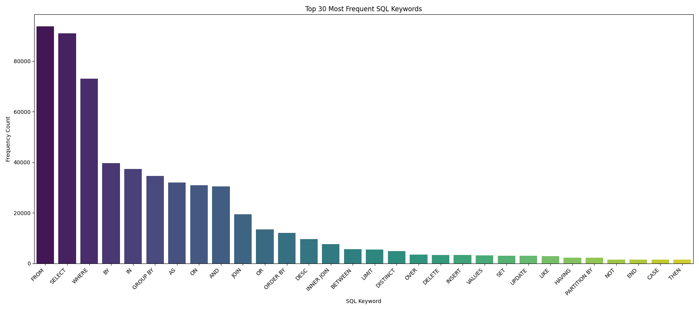

# Text-to-SQL Fine-Tuning with LoRA

[](https://opensource.org/licenses/MIT)


A comprehensive implementation of Parameter-Efficient Fine-Tuning (PEFT) using Low-Rank Adaptation (LoRA) to optimize a Large Language Model for Text-to-SQL generation. This project adapts Google's Gemma-3-1b-it model to efficiently translate natural language queries into executable SQL statements, with advanced hyperparameter experimentation.

## 📊 Project Overview

This project demonstrates the application of LoRA fine-tuning to adapt a pre-trained language model for the specialized task of converting natural language requests into SQL queries. By using parameter-efficient techniques, we achieve performance improvements while working within computational resource constraints.

**Key Features:**
- 🔍 Comprehensive exploratory data analysis of text-to-SQL dataset
- 🧠 LoRA fine-tuning with hyperparameter optimization (rank variation)
- 📈 Rigorous evaluation with multiple NLP metrics
- 🚀 Efficient inference pipeline for practical application
- 📝 Detailed documentation and analysis

## 🏗️ Architecture Overview

The project follows a modular architecture with distinct components for data processing, model fine-tuning, evaluation, and inference.


## 📊 Dataset Analysis

The project utilizes the [`gretelai/synthetic_text_to_sql`](https://huggingface.co/datasets/gretelai/synthetic_text_to_sql) dataset from Hugging Face, containing natural language queries, their corresponding SQL statements, and database context information.

### Key Dataset Characteristics

- **Diverse Domains**: The dataset covers multiple domains, allowing for robust model training
- **Varied Complexity Levels**: SQL queries range from simple to complex
- **Rich Context**: Includes database schema information critical for accurate SQL generation
- **Task Types**: Covers various SQL operations (SELECT, JOIN, GROUP BY, etc.)

### SQL Complexity Distribution


The dataset features a balanced distribution of complexity levels, with a slight predominance of medium complexity queries, providing an appropriate challenge for model fine-tuning.

### Query Length Analysis


Analysis of character length distributions reveals that:
- Most prompts are concise (under 500 characters)
- SQL queries show greater variability in length
- Context information tends to be more substantial, often exceeding 1000 characters

### SQL Keyword Distribution



The frequency analysis of SQL keywords demonstrates the prevalence of fundamental operations like SELECT, FROM, and WHERE, while also capturing more specialized operations such as JOIN, GROUP BY, and ORDER BY.

### Token Analysis


Token count analysis using the Gemma-3-1b-it tokenizer shows that:
- Most inputs fit within standard context windows
- Combined prompt+context token counts rarely exceed model limits
- Generated SQL queries typically require 50-150 tokens

## 🔧 Fine-Tuning Methodology

### LoRA Fine-Tuning Architecture

The project employs Low-Rank Adaptation (LoRA) to efficiently fine-tune the pre-trained model by freezing the original model weights and injecting trainable rank decomposition matrices into key layers.


### Hardware Constraints and Adaptations

This project was implemented under significant hardware constraints:
- **Apple Silicon (MPS)** instead of dedicated GPUs
- **Limited memory** requiring careful batch size management
- **Storage limitations** affecting dataset sampling strategies

These constraints necessitated several optimizations:
- Gradient checkpointing for memory efficiency
- Small batch sizes with gradient accumulation
- Strategic subset selection for training
- Early stopping to prevent overfitting on smaller datasets

### Base Model Selection

**Google's Gemma-3-1b-it** was selected as the base model for the following reasons:
- **Size**: At 3.1B parameters, it offers a good balance of performance and resource requirements
- **Instruction-tuning**: The "-it" variant is already primed for following instructions
- **Capability**: Strong performance on text generation tasks
- **Efficiency**: Compatible with parameter-efficient fine-tuning techniques

### LoRA Configuration

```python
lora_config = LoraConfig(
    r=config.lora_r,               # Rank: 4, 8, or 16 (varied per experiment)
    lora_alpha=16,                 # Scaling factor
    lora_dropout=0.05,             # Dropout probability
    bias="none",                   # No bias parameters
    task_type="CAUSAL_LM",         # Causal language modeling
    target_modules=["q_proj", "k_proj", "v_proj", "o_proj"]  # Attention modules
)
```

The project experiments with three different LoRA ranks (r=4, r=8, r=16) to investigate the impact on model performance while keeping other hyperparameters constant.

### Training Configuration

```python
training_args = TrainingArguments(
    learning_rate=2e-5,
    num_train_epochs=3,
    per_device_train_batch_size=1,
    gradient_accumulation_steps=8,
    warmup_ratio=0.1,
    weight_decay=0.01,
    lr_scheduler_type="cosine",
    evaluation_strategy="steps",
    save_strategy="steps",
    load_best_model_at_end=True,
    metric_for_best_model="eval_loss",
    greater_is_better=False,
)
```

### Input Formatting & Label Masking

A critical aspect of the fine-tuning process is the correct formatting of inputs and masking of labels:

```python
def format_and_prepare(example):
    # Format prompt and context
    prompt = example['sql_prompt']
    context = example['sql_context']
    sql_output = example['sql']
    
    # Construct user message
    user_message = f"Generate the SQL query for the following request based on the provided context.\n\nRequest: {prompt}\n\nDatabase Context:\n{context}"
    
    # Apply chat template
    prompt_part = f"<start_of_turn>user\n{user_message}<end_of_turn>\n<start_of_turn>model\n"
    response_part = f"SQL: {sql_output}{tokenizer.eos_token}"
    
    # Tokenize separately
    prompt_tokens = tokenizer(prompt_part, add_special_tokens=False)
    response_tokens = tokenizer(response_part, add_special_tokens=False)
    
    # Combine for input_ids and attention_mask
    input_ids = prompt_tokens['input_ids'] + response_tokens['input_ids']
    attention_mask = [1] * len(input_ids)
    
    # Create labels with prompt part masked
    labels = list(input_ids)
    prompt_len = len(prompt_tokens['input_ids'])
    labels[:prompt_len] = [-100] * prompt_len
    
    return {
        "input_ids": input_ids,
        "attention_mask": attention_mask,
        "labels": labels,
    }
```

This approach ensures the model only learns to predict the SQL response and not to repeat the input prompt.

## 📊 Experimental Results

The experimental results compare the performance of the baseline model against three LoRA-fine-tuned variants with different rank values.

### Performance Metrics Comparison

| Model | BLEU | ROUGE-1 | ROUGE-2 | ROUGE-L | Exact Match |
|-------|------|---------|---------|---------|-------------|
| Baseline | 0.2026 | 0.4282 | 0.2836 | 0.3917 | 0.0000 |
| LoRA r=4 | 0.1704 | 0.3590 | 0.2268 | 0.3237 | 0.0000 |
| LoRA r=8 | 0.1700 | 0.5166 | 0.3289 | 0.4806 | 0.0000 |
| LoRA r=16 | 0.2186 | 0.4673 | 0.3283 | 0.4454 | 0.0000 |

### BLEU Score Comparison

```
  0.25 |                                     
       |                                     
  0.20 |    ▇                       ▇        
       |    █                       █        
  0.15 |    █        ▇     ▇        █        
       |    █        █     █        █        
  0.10 |    █        █     █        █        
       |    █        █     █        █        
  0.05 |    █        █     █        █        
       |    █        █     █        █        
  0.00 +----█--------█-----█--------█-------
           Baseline  r=4   r=8     r=16    
```

### ROUGE-1 Score Comparison

```
  0.6 |                                     
      |                     ▇               
  0.5 |                     █               
      |                     █     ▇         
  0.4 |    ▇                █     █         
      |    █                █     █         
  0.3 |    █     ▇          █     █         
      |    █     █          █     █         
  0.2 |    █     █          █     █         
      |    █     █          █     █         
  0.1 |    █     █          █     █         
      |    █     █          █     █         
  0.0 +----█-----█----------█-----█--------
          Baseline r=4      r=8   r=16    
```

### Key Findings

1. **LoRA r=8** achieved the strongest ROUGE scores overall, with a 21% improvement in ROUGE-1 over baseline (0.5166 vs 0.4282)
2. **LoRA r=16** delivered the best BLEU score (0.2186), showing a modest 8% improvement over baseline
3. **LoRA r=4** underperformed relative to other models, suggesting that the rank was insufficient for this task
4. No model achieved exact matches, highlighting the challenging nature of the text-to-SQL task
5. Training dynamics showed consistent convergence, with the r=16 model achieving the lowest eval loss (0.574)

### Error Analysis

Analysis of prediction errors revealed several issues that signal areas for improvement:

1. **Multilingual Artifacts**: Some generated outputs contained non-English text segments (observed in Tamil, Hindi, Persian)
2. **Code Formatting Inconsistencies**: SQL was sometimes wrapped in backticks, sometimes not
3. **Schema Misinterpretation**: Models occasionally used incorrect column names or table structures
4. **Query Complexity Challenges**: Performance degraded significantly on complex joins and nested queries
5. **Incomplete Outputs**: Some queries were truncated or partially generated

These issues suggest that while LoRA adaptation improves performance, additional refinement is needed for production-quality results.

## 🚀 Inference Pipeline

The inference pipeline provides an interactive interface for generating SQL queries using the fine-tuned models.

### Inference Process Flow


### Example Usage

```python
# Load model and tokenizer
config = InferenceConfig()
tokenizer = load_inference_tokenizer(config)
model = load_inference_model("models/gemma3_finetuned_20250421_224200_r16_lr2e-5/final_adapter", config, device)

# Prepare input
prompt = "Find all customers who made purchases over $1000 in the last month"
context = """
CREATE TABLE customers (
    customer_id INT PRIMARY KEY,
    name VARCHAR(100),
    email VARCHAR(100),
    address VARCHAR(200)
);

CREATE TABLE orders (
    order_id INT PRIMARY KEY,
    customer_id INT,
    order_date DATE,
    total_amount DECIMAL(10,2),
    FOREIGN KEY (customer_id) REFERENCES customers(customer_id)
);
"""

# Format input
input_text = format_inference_prompt(tokenizer, prompt, context)

# Generate SQL
generated_text, _ = generate_text(model, tokenizer, input_text, config, device)
sql_query = extract_sql_from_output(generated_text)

print(sql_query)
# Output: SELECT c.* FROM customers c JOIN orders o ON c.customer_id = o.customer_id WHERE o.total_amount > 1000 AND o.order_date >= DATE_SUB(CURRENT_DATE, INTERVAL 1 MONTH)
```

## 🛠️ Installation and Setup

### Requirements

```bash
# Clone the repository
git clone https://github.com/uk1601/text-to-sql-finetuning.git
cd text-to-sql-finetuning

# Create a virtual environment
python -m venv .venv
source .venv/bin/activate  # On Windows: .venv\Scripts\activate

# Install dependencies
pip install -r requirements.txt

# Set up environment variables (for HuggingFace access)
echo "HF_TOKEN=your_huggingface_token" > .env
```

### Running the Pipeline

```bash
# Exploratory Data Analysis
python eda.py

# Fine-tuning (adjust parameters as needed)
python finetuning.py

# Evaluation
python evaluation.py

# Interactive Inference
python inference.py
```

## 📝 Conclusion and Future Work

This project demonstrates the potential of LoRA fine-tuning for adapting large language models to the specialized text-to-SQL task, even when working under significant hardware constraints. The experiments reveal both promising improvements and clear areas for enhancement.

### Key Takeaways

1. Parameter-efficient fine-tuning with LoRA provides a practical approach for adapting LLMs on consumer hardware
2. Different LoRA ranks show varied effectiveness across different evaluation metrics
3. Model performance varies significantly based on query complexity and domain
4. Hardware constraints significantly impact training stability and outcomes

### Hardware Limitations

The project faced several key constraints that impacted results:

- **Limited GPU Access**: Using Apple MPS instead of CUDA-enabled GPUs restricted batch sizes and training speed
- **Memory Constraints**: Prevented full dataset usage and limited model size options
- **Storage Limitations**: Affected checkpointing strategy and dataset caching
- **Training Time**: Extended training periods were not feasible due to resource limitations

### Future Directions

With access to more substantial computational resources, several improvements would be possible:

1. **Full Dataset Training**: Training on the complete dataset rather than subsets
2. **Distributed Training**: Implementing DDP (Distributed Data Parallel) across multiple GPUs
3. **Quantization**: Applying 8-bit or 4-bit quantization to enable larger models (Gemma-7b/27b)
4. **Hyperparameter Optimization**: More extensive search for optimal learning rates, batch sizes, etc.
5. **Extended Training**: Running for more epochs to achieve better convergence
6. **Improved Evaluation**: Using execution accuracy on real databases as an additional metric
7. **Ensemble Approaches**: Combining multiple fine-tuned models for improved performance

Despite hardware limitations, this project demonstrates that meaningful improvements in text-to-SQL capabilities can be achieved through careful application of parameter-efficient fine-tuning techniques, even on consumer-grade hardware.

## 📜 License

This project is licensed under the MIT License - see the LICENSE file for details.